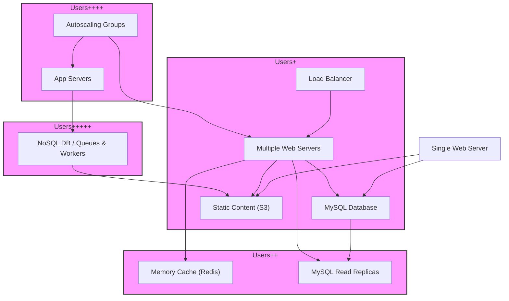

# Architectural Patterns & Trade-offs

Discover the common architectural patterns and principles essential for designing scalable, fault-tolerant, and highly available systems. This guide walks you through key architectural styles—from monoliths to microservices—and the fundamental principles such as separation of concerns, fault tolerance, and high availability. You will learn how to identify and evaluate trade-offs in architecture decisions aligned with real-world system requirements.

---

## 1. Introduction to Architectural Patterns

Architectural patterns provide reusable solutions to common system organization challenges. Choosing the right pattern shapes how components interact, how data flows, and how the system scales and recovers from failures.

### Common Architectural Styles

- **Monolithic Architecture**
  - Single-tiered software where all components are interlinked and deployed as one unit.
  - Easiest to start with, suitable for small user bases.

- **Client-Server Architecture**
  - Clients make requests to central servers.
  - Separation improves scalability over monoliths, clarifies responsibilities.

- **Microservices Architecture**
  - Systems composed of small, independently deployable services.
  - Each microservice handles a focused business function.
  - Enhances scalability, availability, and maintainability but adds operational complexity.

### Why Patterns Matter to You

Selecting the right architectural pattern ensures your system:

- Addresses current and future scalability needs
- Maintains manageable complexity
- Provides fault tolerance and high availability
- Balances development speed and operational overhead

---

## 2. Core Architectural Principles

Understanding these principles helps you analyze how patterns solve real problems and what trade-offs they bring.

### Separation of Concerns

Dividing system responsibility into discrete components or layers reduces coupling, promotes reusability, and supports scalability. Common separations include:

- Presentation Layer (UI)
- Business Logic / Application Layer
- Data Storage Layer

### Fault Tolerance

Systems must gracefully handle partial failures without full downtime.

Examples:

- Redundancy with fail-over (Active-Passive, Active-Active)
- Replication of data
- Health monitoring and automatic recovery

### High Availability

Availability defines the percentage of time a system is functional. You design for "nines" of uptime (e.g., 99.99%).

Techniques:

- Load balancing
- Horizontal scaling
- Distributed components across availability zones

---

## 3. Progressive System Scaling & Evolution

Architectural choices evolve as your service scales from a few users to millions.

### Starting Simple: Single Box / Monolith

- One web server with a local database (e.g., MySQL)
- Vertical scaling by upgrading hardware
- Trade-off: Simplicity vs Lack of redundancy and limited scaling

### Independent Components: Client-Server & Two-Tier

- Separate web/application servers from databases
- Using Elastic IPs and DNS for resiliency
- Add an object store for static assets (e.g., S3)
- Trade-off: Slight complexity increase but greater independence and scale

### Horizontal Scaling for Availability and Load

- Add multiple web/application servers behind load balancers (e.g., ELB, HAProxy)
- Deploy across multiple availability zones
- Use content delivery networks (CDNs) for static/dynamic content
- Database replicas for read scaling and fault tolerance
- Trade-off: More complexity and cost but substantial availability gains

### Heavy Load: Cache Layers and Replica Sets

- Introduce memory caches (e.g., Redis, Elasticache) for hot data and sessions
- Add MySQL Read Replicas and load balancing
- Allow web servers to be stateless for autoscaling
- Trade-off: Cache consistency challenges, increased architectural complexity

### Autoscaling and DevOps Automation

- Use cloud autoscaling to handle traffic spikes and cost savings
- Automated deployments via tools like Chef, Puppet, or Ansible
- Continuous monitoring with tools like CloudWatch, PagerDuty, Sentry
- Trade-off: Latency in scaling reactions and increased orchestration complexity

### Massive Scale: Data Warehousing and NoSQL

- Use data warehouses (e.g., Redshift) for archival and analytical workloads
- Employ NoSQL for extremely high read/write volumes and flexible schemas
- Partition backend into asynchronous queues and worker services
- Trade-off: Increased operational overhead for complex asynchronous workflows

---

## 4. Evaluating Trade-offs: What You Must Consider

Every architectural decision carries pros and cons. Assess these factors explicitly.

| Trade-off Dimension       | Benefits                                      | Limitations / Risks                              |
|--------------------------|-----------------------------------------------|-------------------------------------------------|
| **Monolith vs Microservices** | Simplicity, fast development                 | Difficult to scale, slower deployment cycles     |
| **Vertical vs Horizontal Scaling** | Quick setup, fewer moving parts                | Expensive at scale, single point of failure      |
| **Cache Use**              | Faster response, reduced DB load               | Cache consistency, stale data, invalidation complexity |
| **Replication & Failover** | Improved availability and fault tolerance     | Data loss risk during failover, complexity       |
| **Synchronous vs Asynchronous** | Predictable processing, easier debugging      | Latency, complexity in asynchronous message handling |
| **SQL vs NoSQL**          | Strong consistency, complex queries            | Limited horizontal scaling, rigid schema          |

---

## 5. Practical Examples & Scenarios

### Scenario: Scaling a Web Service from 100 to 1 Million Users

| Stage      | Architectural Choice                              | User Impact                                    |
|------------|-------------------------------------------------|------------------------------------------------|
| Initial    | Monolith on a single large EC2 instance          | Simple deployment, no redundancy               |
| Growth     | Separate DB to RDS, use S3 for assets            | Improved scalability, small config changes     |
| User+      | Add ELB and multiple web servers                  | Reduction in downtime, better latency          |
| User++     | Introduce read replicas and memcache              | Handle read-heavy loads, improve responsiveness|
| User+++    | Add autoscaling for frontends and app servers     | Cost efficient, handles spikes                   |
| User++++   | Move analytics to Redshift, archives to S3       | Long-term data storage, improved analytics      |
| User+++++  | Use NoSQL databases and asynchronous workers      | Handles extremely heavy load, more complex ops  |

### Tips for Weighing Trade-offs in Interviews

- Base decisions on clear user needs and growth projections.
- Discuss pros and cons explicitly.
- Mention monitoring and iterative testing to adjust architecture over time.
- Consider team size and operational capacity when suggesting complex layers.

---

## 6. Summary

Architectural patterns and trade-offs are the foundation for building robust, scalable systems. Understanding common patterns such as monoliths, client-server, and microservices—and principles like separation of concerns, fault tolerance, and high availability—helps you design systems that meet both immediate and long-term demands. Through progressive scaling and measured decision-making, you can balance performance, cost, complexity, and reliability.

---

## Additional Resources

- [Design a system that scales to millions of users on AWS](https://github.com/donnemartin/system-design-primer/blob/main/solutions/system_design/scaling_aws/README.md) — Detailed stepwise AWS scaling patterns
- [Microservices](https://github.com/donnemartin/system-design-primer#microservices) — Architectural style focusing on small independent services
- [Load balancer](https://github.com/donnemartin/system-design-primer#load-balancer) — How to distribute traffic
- [Cache](https://github.com/donnemartin/system-design-primer#cache) — Caching strategies and their trade-offs
- [Relational database management system (RDBMS)](https://github.com/donnemartin/system-design-primer#relational-database-management-system-rdbms) — SQL scaling patterns

---

### Sample Mermaid Diagram for Evolving Architecture

This diagram illustrates typical architectural evolution stages as user base grows from small to massive.

---

## Troubleshooting Common Pitfalls

- **Overcomplex architecture early on**: Start simple and grow incrementally.
- **Ignoring data flow bottlenecks**: Profile your database and caches, optimize queries.
- **Neglecting fault tolerance**: Design for fail-over and redundancy from day one.
- **Underestimating cache invalidation complexity**: Select a suitable caching pattern.
- **Over-reliance on vertical scaling**: Horizontal scaling is often more cost-effective at scale.

---

For a full practical deep dive, please explore the linked [Design a system that scales to millions of users on AWS](https://github.com/donnemartin/system-design-primer/blob/main/solutions/system_design/scaling_aws/README.md) document that meticulously covers all scaling stages and trade-offs.
