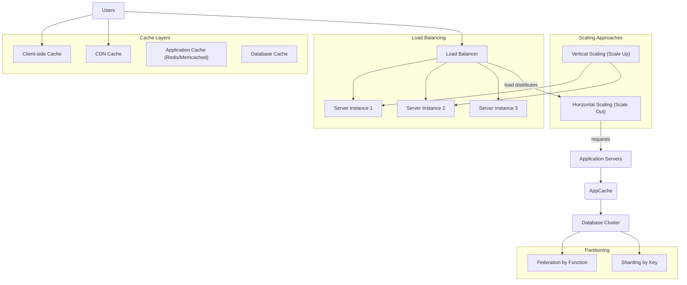

# Scalability & Performance Models

Explore how systems scale horizontally and vertically; the role of load balancing, caching, and partitioning; and how to measure and optimize key performance metrics such as latency and throughput.

---

## Introduction to Scalability and Performance

Scalability and performance are vital concepts when designing systems to support growth in users, data, and requests. Understanding these concepts empowers you to build systems that not only serve current demand but can adapt cost-effectively as you grow.

- **Vertical Scaling** (Scaling Up): Enhancing a single machine’s resources (CPU, memory, disk) to improve capacity.
- **Horizontal Scaling** (Scaling Out): Adding more machines to distribute load and increase capacity.

Balancing these strategies with techniques like load balancing, caching, and partitioning enables a system to efficiently meet performance goals such as low latency and high throughput.

---

## Horizontal and Vertical Scaling

### Vertical Scaling

Vertical scaling means upgrading the resources of a single instance (e.g., a bigger server).

- **Advantages:** Simple to implement initially, minimal architectural changes.
- **Disadvantages:** Can become very costly, limited by hardware capabilities, introduces a single point of failure.

_Practical tip:_ Vertical scaling suits early-stage systems with limited users, where complexity must be kept low.

### Horizontal Scaling

Horizontal scaling involves adding multiple instances and distributing the workload among them.

- **Advantages:** Offers better redundancy and fault tolerance, cost-effective with commodity hardware, elastic scaling with demand.
- **Disadvantages:** Increases system complexity, requires stateless servers or shared session management.

_Load balancers_ are key to distributing requests evenly across multiple servers.

### When to choose

Start vertical scaling in the early phase, and evolve into horizontal scaling as usage and availability requirements grow.

---

## The Role of Load Balancing

Load balancing is the technique of distributing incoming requests across multiple servers to optimize resource use, increase throughput, and reduce response times.

### Key Features

- **Prevents Overloading:** Keeps any single server from being a bottleneck.
- **Enables High Availability:** Ensures requests are routed to healthy servers.
- **Supports Horizontal Scaling:** Seamlessly adds or removes servers based on load.

### Types

- **Active-Passive:** One load balancer handles traffic while the other is standby.
- **Active-Active:** Multiple load balancers actively handle traffic, sharing the load.

### Load Balancing Layers

- **Layer 4 (Transport Layer):** Routes traffic based on IP addresses and ports.
- **Layer 7 (Application Layer):** Routes traffic based on content, such as URL paths and cookies.

### Best Practices

- Terminate SSL at the load balancer to offload backend servers.
- Distribute servers across availability zones to improve fault tolerance.
- Ensure backend servers are stateless to enable effective horizontal scaling.

---

## Caching Mechanisms and Strategies

Caching improves performance by storing frequently accessed data closer to the client, reducing load on backend systems and lowering latency.

### Where to cache

- **Client Side:** Browser or OS caches for static resources.
- **CDN (Content Delivery Network):** Distributed cache closer to users.
- **Web Server:** Reverse proxy caches static and dynamic content.
- **Database Cache:** In-memory caches within the database layer.
- **Application Cache:** In-memory caching layers like Redis or Memcached.

### What to cache

- **Database query results:** Cache query responses.
- **Objects:** Cache fully assembled objects or pages.

### Cache update policies

- **Cache-Aside (Lazy Loading):** The application loads data from the cache if present; otherwise, it fetches from the data store and populates the cache.
- **Write-Through:** Writes go through the cache which synchronously updates the data store.
- **Write-Behind (Write-Back):** Writes update the cache immediately, and asynchronously the data store.
- **Refresh-Ahead:** Cache proactively refreshes entries before expiration.

### Common pitfalls

- Cache staleness: Ensure your cache invalidation strategy prevents outdated data.
- Cache misses: Minimize cold start latency on new servers via preload or warm-up techniques.

---

## Partitioning and Data Distribution Techniques

When data scale surpasses single node capacities, partitioning (also called sharding) divides data across multiple storage instances.

### Approaches

- **Federation:** Partition data by function or domain (e.g., separate databases for users, products, forums).
- **Sharding:** Partition data horizontally based on a key (e.g., user ID ranges).

### Benefits

- Enables parallelism with distributed writes and reads.
- Reduces replication lag and index size.
- Improves cache locality and fault isolation.

### Challenges

- Application complexity increases due to need to route queries appropriately.
- Uneven data distribution can cause hot spots.
- Complex joins across shards or federated databases.

Consistency models and data replication strategies should complement partitioning to ensure required availability and fault tolerance.

---

## Measuring and Optimizing Performance

### Key Metrics

- **Latency:** Time taken to respond to a request.
- **Throughput:** Number of requests processed per unit time.

Aim to maximize throughput with acceptable latency thresholds.

### Latency Benchmarks

| Operation                                 | Latency          |
|-------------------------------------------|------------------|
| Memory reference (L1 cache)               | 0.5 ns           |
| Memory reference (main memory)            | 100 ns           |
| SSD read (4 KB random)                     | 150 μs     |
| SSD sequential read (1 MB)                 | 1 ms             |
| HDD sequential read (1 MB)                 | 30 ms            |
| Datacenter round trip                      | 500 μs     |

### Bottlenecks

- Network bandwidth
- CPU and memory limits
- Disk I/O
- Contention on shared resources like databases or caches

### Optimizations

- Profile and benchmark to identify critical resources
- Implement caching at various layers
- Use asynchronous processing to avoid blocking
- Add autoscaling groups that adjust based on metrics like CPU or latency
- Denormalize or tune database schemas and queries

---

## Autoscaling and Dynamic Resource Provisioning

Autoscaling dynamically adjusts resources in response to load, ensuring capacity during peaks and reducing costs when demand drops.

- Use CloudWatch or equivalent monitoring for key metrics.
- Configure minimum and maximum instances per server group.
- Combine with load balancers for seamless traffic distribution.

Considerations:
- Autoscaling can add complexity and delay before scaling reacts.
- Setup requires automation tools (Chef, Puppet, Ansible).

---

## Summary

This document introduced the key models and mechanisms that allow systems to scale and perform efficiently in response to growth and variability in load. From vertical scaling of individual machines to horizontal scaling with load balancing, partitioning, and caching, these patterns are pivotal to modern system design. Performance metrics such as latency and throughput guide optimization efforts, supported by autoscaling and monitoring for adaptive resource provisioning.

---

## References and Further Reading

- [Scaling a system to millions of users on AWS (Donne Martin)](https://github.com/donnemartin/system-design-primer/blob/main/solutions/system_design/scaling_aws/README.md)
- [Caching Strategies](https://github.com/donnemartin/system-design-primer#cache)
- [Load Balancer Patterns](https://github.com/donnemartin/system-design-primer#load-balancer)
- [Database Partitioning & Sharding](https://github.com/donnemartin/system-design-primer#sharding)
- [Latency numbers every programmer should know](https://github.com/donnemartin/system-design-primer#latency-numbers-every-programmer-should-know)

---

## Diagrams

