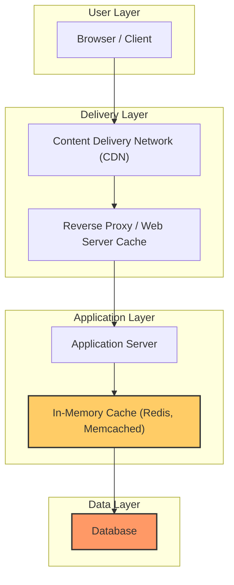

# Caching Strategies & Patterns

Master the foundational concepts of in-memory caching, key cache invalidation strategies, and essential caching patterns such as cache-aside, write-through, and write-behind. Explore where caching integrates within layered system architectures and understand its crucial role in enhancing overall system responsiveness.

---

## Understanding the Role of Caching

Imagine you’re building a web application that serves millions of user queries per day. Without caching, every request results in a direct call to the database or backend service, potentially causing high latency and heavy load. Caching acts like a fast-access bookshelf where popular and recently used data is stored temporarily, enabling quicker retrieval and reducing backend pressure.

### Why Cache?
- **Reduce Latency:** Serve data instantly from fast memory instead of slower disk or network calls.
- **Lower Backend Load:** Minimize queries to databases or downstream services.
- **Improve Throughput:** Support more users by reducing bottlenecks.

<Info>
Caching is not a silver bullet; it requires careful strategy to maintain data accuracy and consistency.
</Info>

---

## When to Cache and What to Cache

### Levels of Caching
- **Client Caching:** Data cached on the user’s device or browser enables repeated fast access without contacting servers.
- **Content Delivery Network (CDN):** Distributes cached static content globally closer to users.
- **Web Server Cache:** Reverse proxies or application servers caching rendered responses or static assets.
- **Database Cache:** Built-in or external caches that store query results or high-demand objects.
- **Application Cache:** In-memory key-value stores like Redis or Memcached used between app and database layers.

### What to Cache
- Entire objects or frequently accessed pages
- Partial query results
- Computed data or aggregated metrics

<Note>
Avoid caching raw files or unstable data that can complicate consistency and scaling.
</Note>

---

## Cache Invalidation: When to Update the Cache?

Keeping cached data fresh is one of the hardest problems in caching.

The main strategies with trade-offs are:

### 1. Cache-Aside (Lazy Loading)
- Application first tries to read from cache.
- Cache miss triggers a load from the database.
- The fresh data is written back to cache.

```python
# Example of cache-aside pattern
 def get_user(user_id):
     user = cache.get(f'user.{user_id}')
     if user is None:
         user = db.query(f'SELECT * FROM users WHERE id = {user_id}')
         if user:
             cache.set(f'user.{user_id}', user)
     return user
```

#### Pros
- Simple to implement
- Only requested data is cached

#### Cons
- Latency spike on cache miss
- Possible stale reads

### 2. Write-Through
- Applications write data to cache.
- Cache synchronously writes data to the database.

```python
# Write-through example
 def set_user(user_id, user_data):
     db.update(user_id, user_data)
     cache.set(user_id, user_data)
```

#### Pros
- Cache always up-to-date
- Reads are consistent

#### Cons
- Write latency penalty due to synchronous DB write
- New cache nodes start empty until DB writes happen

### 3. Write-Behind (Write-Back)
- Application writes to cache.
- Cache asynchronously writes to database in background.

#### Pros
- Fast writes
- Reduces database load spikes

#### Cons
- Risk of data loss on cache failure before write
- More complex to implement and maintain

### 4. Refresh-Ahead
- Cache proactively refreshes entries before expiry.
- Predicts what data might be requested next to pre-warm cache.

#### Pros
- Reduces latency spikes

#### Cons
- Requires accurate prediction
- Risk of wasted resources if predictions are off

<Check>
Choosing the correct cache invalidation strategy is essential to balance freshness, latency, and complexity.
</Check>

---

## Core Caching Patterns

### Cache-Aside (Lazy Loading)
The most widely used pattern—app directly manages cache reads and writes.

### Write-Through
Cache is updated synchronously with DB writes; ensures cache consistency.

### Write-Behind
Writes are buffered in the cache and asynchronously flushed to DB.

### Refresh-Ahead
Cache entries are automatically refreshed before they expire.

---

## Where Does Caching Fit in the Layered Architecture?

Caching can be deployed at multiple points in a system’s layered architecture. Typical integration points include:

- Between **application layer** and **database** to speed up data access.
- Front of **web servers** to cache static/dynamic page content.
- As part of **CDNs** for global proximity cache.

Understanding these layers helps in designing where caching most effectively reduces latency and load.



---

## Practical Tips and Best Practices

- Use **LRU or other eviction policies** to keep cache size bounded.
- Set appropriate **Time-To-Live (TTL)** values balancing freshness and cache hit rates.
- Be mindful of **cache stampede** where many misses flood DB; use locking or request coalescing.
- Combine caching with **load balancing and sharding** to scale horizontally.
- Monitor cache metrics: hit ratio, eviction rates, latency.
- Use multi-layer caching with CDNs, server caches, and application caches.

<Warning>
Avoid re-caching every request with different keys; normalize keys to improve hit rates.
</Warning>

---

## Troubleshooting Common Issues

### Cache Misses
- Check cache key correctness.
- Review TTL expirations.
- Inspect memory limits and eviction policies.

### Stale Data
- Verify cache invalidation strategy.
- Match database update paths to cache update.

### Performance Degradation
- Monitor cache hit ratio.
- Scale cache clusters and use sharding.

---

## Summary

Master the key caching concepts and patterns—cache-aside, write-through, write-behind, and refresh-ahead—and understand their tradeoffs. Strategically place caching in the architecture to improve responsiveness and scalability. Apply best practices for cache invalidation and monitor to prevent common pitfalls.

---

## Further Reading and Resources

- [System Design Primer: Cache](https://github.com/donnemartin/system-design-primer#cache)
- [AWS ElastiCache Strategies](http://docs.aws.amazon.com/AmazonElastiCache/latest/UserGuide/Strategies.html)
- [Cache invalidation on Wikipedia](https://en.wikipedia.org/wiki/Cache_algorithms)
- [From cache to in-memory data grid](http://www.slideshare.net/tmatyashovsky/from-cache-to-in-memory-data-grid-introduction-to-hazelcast)
- [Scalable System Design Patterns](http://horicky.blogspot.com/2010/10/scalable-system-design-patterns.html)
- [Latency numbers every programmer should know](https://github.com/donnemartin/system-design-primer#latency-numbers-every-programmer-should-know)

---

This page focuses specifically on caching strategies and patterns, enabling you to integrate caching thoughtfully to achieve system goals.

