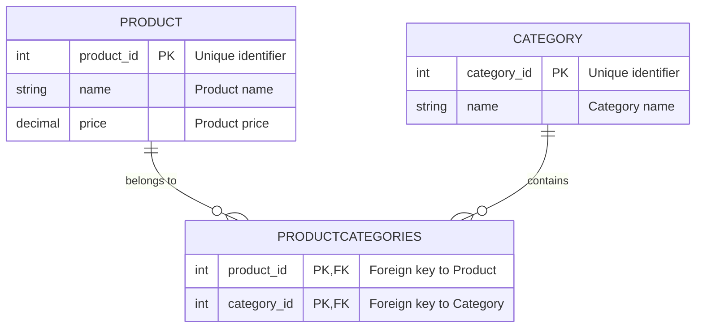

# Data Modeling Basics

Learn how to represent entities, relationships, and metadata with sound data modeling practices. Understand the differences between normalized and denormalized schema designs and their impact on scalability and maintainability.

---

## Introduction to Data Modeling

Data modeling is the process of structuring and organizing data in a system to accurately represent real-world entities, their attributes, and the relationships between them. Effective data models are foundational to building scalable, maintainable, and high-performance systems.

By representing data correctly, you enable efficient querying, consistency, and flexibility in growing and evolving your system.

## Core Concepts

### Entities and Attributes

- **Entities**: Real-world objects or concepts you want to represent, such as `User`, `Product`, `Transaction`, or `Category`.
- **Attributes**: Properties or details of an entity, e.g., a `User` might have `user_id`, `name`, and `email`.

### Relationships Between Entities

Entities may be associated with one another:

- **One-to-One (1:1)**: Each entity instance relates to one instance of another entity.
- **One-to-Many (1:N)**: One entity instance relates to multiple instances of another entity.
- **Many-to-Many (M:N)**: Multiple instances of one entity relate to multiple instances of another.

Relationships often require foreign keys or linking tables in relational models.

### Metadata

Metadata provides additional context about data:

- Schema information (field types, constraints)
- Data lifecycle information (creation date, last update)
- Operational details (status, flags)

Incorporating metadata aids data quality, auditing, and system operations.

## Normalized vs Denormalized Schema Designs

### Normalization

Normalization involves structuring a relational database to minimize redundancy and dependency by dividing data into multiple related tables.

**Benefits:**

- Eliminates data duplication
- Maintains data integrity
- Simplifies updates and consistency guarantees

**Trade-offs:**

- Requires joining multiple tables in queries, which might impact performance
- Can increase complexity for some read-heavy use cases

**Example:** In normalized design, `Product` and `Category` entities each have separate tables; product-category associations might use foreign keys.

### Denormalization

Denormalization deliberately introduces some redundancy by merging tables or duplicating data to optimize read performance.

**Benefits:**

- Reduces the need for costly joins in read queries
- Enhances performance in read-heavy workloads
- Simplifies reporting and aggregation in some cases

**Trade-offs:**

- Can lead to data inconsistencies if data is not carefully synchronized
- Increases storage requirements
- Complicates write operations due to multiple copies

Denormalization can be essential for large-scale systems that require fast read response times.

## Impact on Scalability and Maintainability

The choice between normalized and denormalized schemas directly impacts both scalability and maintainability:

- **Normalized designs** lead to easier data maintenance but may face performance bottlenecks on large, complex queries.
- **Denormalized designs** improve performance but require rigorous consistency mechanisms and increase complexity in writes.

Scaling techniques such as horizontal partitioning (sharding), indexing, and caching complement data models to achieve desired performance.

## Practical Guidelines and Best Practices

### Start With Normalization for Data Integrity

Begin with a normalized schema to ensure data accuracy and integrity. This approach simplifies updates and reduces anomalies.

### Profile and Optimize for Read Workloads

Monitor query patterns—if read latency and join complexity grow too high, selectively denormalize critical paths.

### Use Indexes and Keys Appropriately

Define primary keys and foreign keys to enforce relationships and optimize lookups.

Apply indexes on frequently queried fields to speed searches.

### Incorporate Metadata Strategically

Design entities to include metadata fields for auditing, versioning, and operational control.

### Expect Iterative Evolution

Data requirements and system scale evolve—be prepared to adjust data models, add denormalization, or introduce new data stores.

### Consider NoSQL Alternatives When Appropriate

For highly scalable or flexible data structures, consider NoSQL data models like key-value stores or document stores, which often use denormalized data by design.

## Common Pitfalls to Avoid

- Over-denormalizing prematurely without profiling
- Ignoring metadata leading to poor auditability
- Neglecting indexes on key fields
- Assuming writes will always be infrequent—plan for write-heavy workloads
- Mixing diverse data models in the same store without orchestration

## Illustrative Example: Product and Category Model

Consider an e-commerce system modeling products and categories:

- A `Product` entity includes `product_id`, `name`, `price`.
- A `Category` entity includes `category_id`, `name`.
- Products can belong to multiple categories (M:N relationship).

### Normalized Schema

- Tables: `Products`, `Categories`, and a join table `ProductCategories` with `product_id`, `category_id` as composite keys.

### Denormalized Schema

- Products table contains a field with a list or array of category identifiers.

This reduces joins but raises update complexities when categories change.

## Sample Entity-Relationship Diagram

## Troubleshooting Common Issues

- **Slow queries with many joins**: Profile with explain plans, add indexes, consider caching or denormalization.
- **Data consistency problems**: Verify foreign keys and constraints, consider transactions.
- **Growing schema complexity**: Modularize data models, use documented schemas.
- **Unpredictable access patterns**: Collect usage metrics to drive model optimization.

## Additional Resources

- [Relational database management system (RDBMS) concepts](https://github.com/donnemartin/system-design-primer#relational-database-management-system-rdbms)
- [Denormalization strategies](https://en.wikipedia.org/wiki/Denormalization)
- [Database sharding & federation strategies](https://github.com/donnemartin/system-design-primer#federation)
- [SQL vs NoSQL considerations](https://github.com/donnemartin/system-design-primer#sql-or-nosql)

## Summary

Data modeling is crucial to system design, balancing clarity, performance, and scalability. Understanding when to normalize for data consistency or denormalize for read speed, combined with indexing and metadata, helps build maintainable and scalable systems.

Follow best practices and iteratively refine models based on system performance and usage patterns.

---

## Further Reading and Navigation

- Explore the [Relational database management system (RDBMS)](/concepts/data-models-and-stores/databases-consistency-availability) for deeper understanding.
- Study denormalization and sharding techniques in [System design best practices](/guides/best-practices-real-world/system-design-best-practices).
- Understand NoSQL data models for alternative flexible data representations.

---