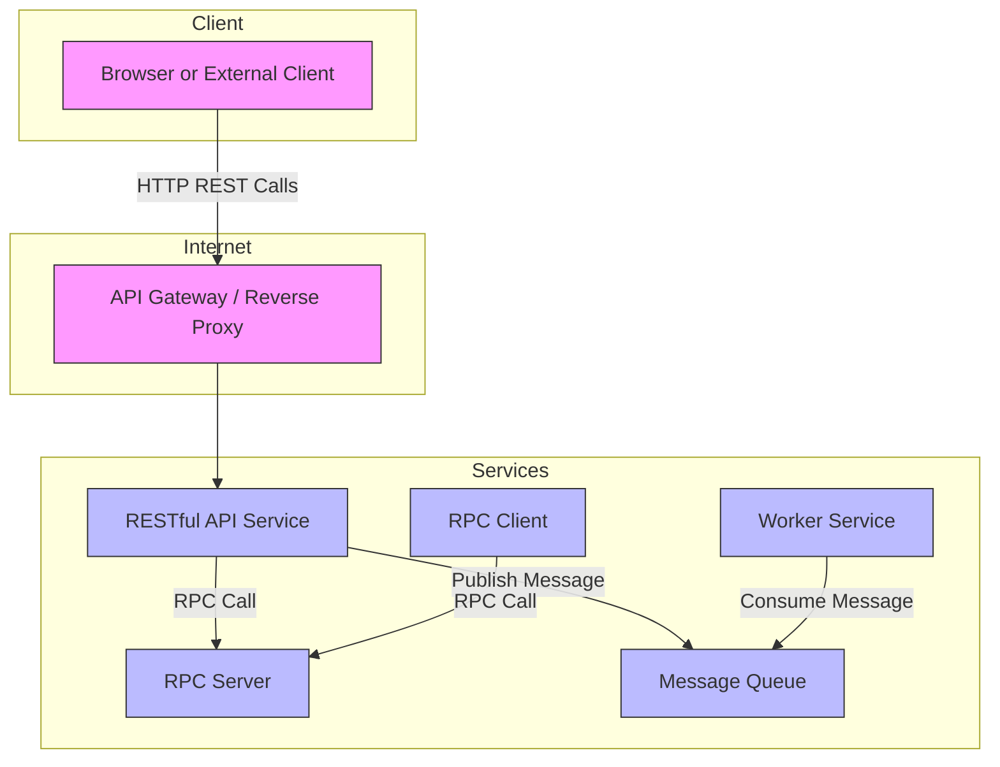

# API, Messaging, and Communication Models

Understanding how systems communicate internally and externally is pivotal in designing scalable, reliable, and maintainable applications. This guide clarifies the distinctions between REST, RPC, and message queuing paradigms, how services exchange data, and how to select the appropriate model based on performance characteristics and use cases.

---

## 1. Overview of Communication Paradigms

### 1.1 REST (Representational State Transfer)

REST is an architectural style enforcing stateless, cacheable communication, emphasizing resource-oriented design. It is commonly used for public HTTP APIs where simplicity, loose coupling, and scalability are priorities.

- **Key Features:**
  - Uses HTTP verbs (GET, POST, PUT, DELETE, PATCH) to operate on resources identified by URIs.
  - Stateless interactions allow easier scaling.
  - Responses can be cached, increasing performance.
  - Self-descriptive error codes reduce complexity.

- **Typical Use Cases:**
  - Public-facing web APIs
  - Services requiring clear resource management

- **Limitations:**
  - Less suited for fine-grained remote procedure calls
  - Difficulty expressing complex operations that don’t fit typical CRUD actions
  - May require multiple round-trips for complex data fetching

### 1.2 RPC (Remote Procedure Call)

RPC simulates local procedure calls to remote services, focusing on invoking behaviors/functions rather than manipulating resources.

- **Key Features:**
  - Encapsulates method call semantics over the network.
  - Can use various protocols (Protobuf, Thrift, Avro) optimizing performance.
  - Tight coupling between client and server due to explicit interfaces.

- **Typical Use Cases:**
  - High-performance internal services communication
  - Where explicit method invocation semantics are needed

- **Limitations:**
  - Difficult debugging and versioning due to tight coupling
  - Less flexible for diverse clients
  - Modifying interfaces requires coordinated client/server updates

### 1.3 Message Queues

Message queues enable asynchronous communication, breaking down tasks into units passed via a queue, allowing decoupled, reliable, and scalable designs.

- **Key Features:**
  - Message producers push jobs to a queue, consumers asynchronously process them.
  - Supports load smoothing and backpressure.
  - Can guarantee delivery (depending on implementation).

- **Typical Use Cases:**
  - Background processing
  - Load leveling and traffic spikes management
  - Event-driven architectures

- **Limitations:**
  - Increases system complexity
  - Introduces latency due to asynchronous nature
  - Requires careful management of message loss and duplication

---

## 2. REST vs. RPC: Choosing the Right Model

| Aspect                     | REST                                            | RPC                                              |
|----------------------------|-------------------------------------------------|--------------------------------------------------|
| Communication Style         | Resource-centric, stateless HTTP protocol       | Behavior-centric, method call abstraction         |
| Flexibility                | High (URI and verbs define the resource interface) | Medium (Strict interface definitions)            |
| Coupling                   | Loose                                            | Tight                                             |
| Ease of Adoption           | Easier for external/public clients               | Often internal use; complex                        |
| Scalability                | Excellent due to statelessness                    | Good, but harder due to stateful interactions     |
| Performance Overhead       | Moderate (parsing overhead, multiple calls)      | Potentially lower (binary protocols, optimized)   |
| Suitable For               | Public APIs, external integrations                | Internal high-performance communications          |
| Debugging and Testing      | Easier, since HTTP standards apply                | Harder due to complex serialization and binding   |

### When to Choose REST

- You want a public-facing API that is easy to consume by any HTTP client such as browsers or third-party services.
- You need scalable, cacheable, and loosely coupled communication.
- Your operations primarily CRUD resource access that REST maps well to.

### When to Choose RPC

- You control both client and server and need high-performance communications.
- The application demands explicit operation invocation beyond standard CRUD.
- You require support for streaming or complex bidirectional communications.

---

## 3. Synchronous vs Asynchronous Communication

Understanding the timing characteristics of your communication model is essential to meeting application performance and scalability goals.

### 3.1 Synchronous Communication

- The client waits for the server to process the request and respond before continuing.
- Common in REST and RPC when used in a request-response style.

### 3.2 Asynchronous Communication

- The client sends a message or job and continues without waiting for the response.
- Common with message queues or event-driven architectures.
- Workers or services consume messages and process independently.

### Choosing Between Synchronous and Asynchronous

| Aspect                  | Synchronous                         | Asynchronous                         |
|-------------------------|-----------------------------------|------------------------------------|
| User experience         | Immediate feedback but can block  | Non-blocking; may see delayed effect |
| Scalability            | Limited by response times          | High: decouples request and processing |
| Complexity             | Lower                           | Higher: requires orchestration, failure handling |
| Use cases              | CRUD APIs, simple request-response | Tasks like email sending, data processing |

---

## 4. Message Queue Architectures and Patterns

### 4.1 Message Queue Types

- **Point-to-point Queues**: One producer, one consumer; reliable delivery.
- **Publish/Subscribe (Pub/Sub)**: Producers publish messages to a topic; multiple subscribers receive them.

### 4.2 Using Message Queues

- Publish jobs/tasks for deferred processing.
- Decouple communications, allowing systems to operate independently.
- Introduce backpressure by limiting the queue size.

### 4.3 Common Message Brokers

- **Redis**: Lightweight, in-memory, but with potential message loss.
- **RabbitMQ**: Supports AMQP protocol, robust but involves management overhead.
- **Amazon SQS**: Hosted, high latency, at-least-once delivery (possible duplicates).

### 4.4 Backpressure and Flow Control

- When queues fill, applications can respond with server busy signals (e.g., HTTP 503) to throttle traffic.
- Clients implement retry mechanisms such as exponential backoff.

---

## 5. Service Communication Scenarios

### 5.1 External Client to Service Communication

- Use RESTful HTTP APIs for browsers, third-party integrations, mobile clients.
- Emphasize stateless, cacheable, and scalable endpoints.

### 5.2 Internal Service-to-Service Communication

- Use RPC for high performance, structured calls.
- May use asynchronous messaging (message queues) for decoupling and buffering.

### 5.3 Hybrid Scenarios

- Combine REST for external APIs with RPC or message queues internally.
- Employ API gateways or reverse proxies to centralize external access.

---

## 6. Troubleshooting Common Communication Issues

### 6.1 Latency and Timeout

- Network or processing delays can cause timeouts.
- Diagnose bottlenecks by profiling service calls.

### 6.2 Message Loss or Duplication

- Use durable queues and acknowledgments to minimize message loss.
- Idempotency in consumer processing can handle duplicate messages safely.

### 6.3 Tight Coupling Issues

- Overuse of RPC can result in difficult-to-maintain, brittle systems.
- Promote asynchronous communication where possible for resilience.

### 6.4 Versioning and Backward Compatibility

- Define API versioning to allow evolution without breaking clients.

---

## 7. Best Practices & Recommendations

- Favor REST for external, public-facing APIs.
- Use RPC for internal microservices where latency is critical.
- Employ message queues for asynchronous, decoupled, and fault-tolerant workflows.
- Apply backpressure and monitoring to maintain system health.
- Ensure APIs are self-describing and use standard protocols to ease client integration.

---

### Additional Resources

- [REST vs RPC](https://apihandyman.io/do-you-really-know-why-you-prefer-rest-over-rpc/)
- [Message Queue vs Task Queue](https://www.quora.com/What-is-the-difference-between-a-message-queue-and-a-task-queue-Why-would-a-task-queue-require-a-message-broker-like-RabbitMQ-Redis-Celery-or-IronMQ-to-function)
- [RPC Protocols Overview](http://www.puncsky.com/blog/2016-02-13-crack-the-system-design-interview)
- [Message Queues and Backpressure](http://mechanical-sympathy.blogspot.com/2012/05/apply-back-pressure-when-overloaded.html)

---

### Mermaid Diagram: Communication Model Overview

---

