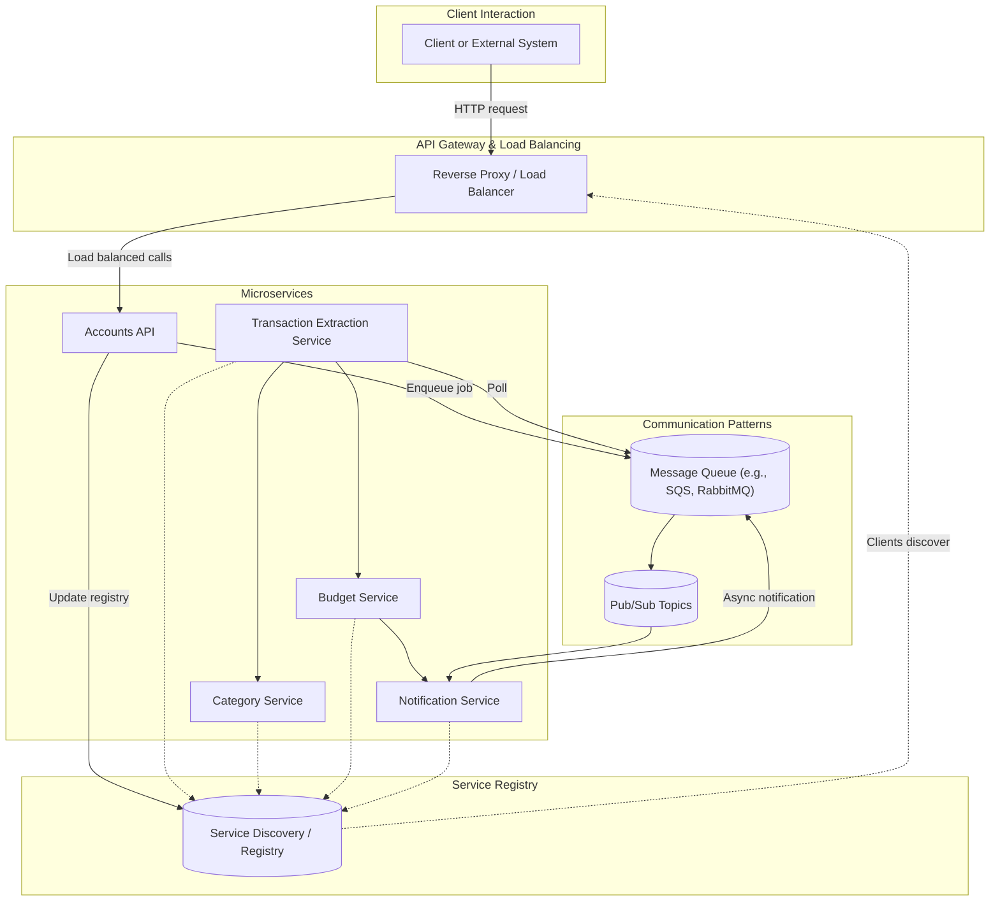

# Integration Patterns & System Interfaces

Explore the foundational integration patterns central to constructing robust, scalable systems and examine how these patterns enable systems to expose, consume, and orchestrate APIs to create seamless end-to-end workflows.

---

## Introduction to Integration Patterns

Modern systems rarely operate in isolation—they rely heavily on communication between components, services, and external systems. Integration patterns provide repeatable, reliable approaches for enabling these communications, ensuring that data and commands flow smoothly and systems interoperate effectively.

This guide surveys core patterns such as service discovery, publish/subscribe, and event-driven architectures, along with practical aspects of how APIs are exposed, consumed, and orchestrated to meet real-world needs.

---

## Core Integration Patterns

### 1. Service Discovery

Service discovery facilitates dynamic identification of service instances in complex distributed environments where services scale up and down frequently.

- **Purpose:** To allow client components and services to locate available service instances without hard-coded addresses.

- **How it works:** Services register themselves with a discovery mechanism (e.g., Consul, Etcd, Zookeeper). Clients query this registry to dynamically find services.

- **Benefits for users:** Ensures resilience and scalability by adapting to changes in service availability automatically.

- **Real-world example:** Within the Mint.com financial service design, internal components likely depend on a registry to locate the varied microservices like Category, Budget, and Notification Services dynamically as they scale.

### 2. Publish/Subscribe (Pub/Sub)

Pub/Sub decouples message producers (publishers) from consumers (subscribers) through message brokers.

- **Interaction flow:** Publishers send messages to topics with no knowledge of subscribers. Subscribers listen to topics of interest and receive messages asynchronously.

- **Advantages:** Enables asynchronous processing, load leveling, and greater system scalability.

- **Use cases:** For example, Mint.com services enqueue notification jobs and transaction extraction tasks on queues such as Amazon SQS or RabbitMQ to be processed asynchronously.

- **Critical tip:** Use queues to handle heavy workloads to prevent blocking user interactions or overloading components.

### 3. Event-Driven Architectures

In event-driven systems, components produce and respond to events asynchronously to create loosely coupled workflows.

- **How it works:** An event producer emits an event that triggers one or more consumers to act, enabling complex chains of activities.

- **Benefits:** Flexibility, scalability, and responsiveness, since components process events independently.

- **Example in Mint.com:** After transaction extraction, the Budget Service reacts by aggregating data; notifications are then asynchronously sent, likely via a messaging queue.

---

## API Exposure and Consumption

### Exposing APIs

APIs are the contract through which services provide their capabilities to clients and other services.

- **RESTful APIs:** Widely adopted for external service communication, using HTTP verbs to represent actions (GET, POST, PUT, DELETE).
    - Example from Mint.com: Clients submit POST requests to Accounts API to link financial accounts.

- **Internal APIs:** For service-to-service communication, often use Remote Procedure Calls (RPC) for performance and tighter coupling.

### Consuming APIs

- **Client flow:** A client request hits a reverse proxy or web server, which forwards to the appropriate API server.

- **API orchestration:** Complex workflows require coordinating multiple services’ APIs:
    - Example: Mint.com’s Transaction Extraction Service calls Category and Budget services sequentially, updating various data stores and triggering notifications.

### Best Practices

- Use asynchronous queues when interactions involve long-running operations to improve responsiveness.
- Employ caching layers between client and API servers to reduce load on backend services.
- Secure APIs via authentication and authorization controls, crucial when financial or personal data is involved.

---

## Orchestration of APIs into End-to-End Workflows

Orchestration ensures that multiple microservices work together to deliver higher-level business functionality.

- **Coordinated execution:** Central controllers or event-driven components invoke API calls following defined sequences.

- **Mint.com example:**
    1. User links financial account via Accounts API.
    2. Transaction extraction workflow is queued.
    3. Extraction Service processes queued job, calls Category Service to label transactions.
    4. Budget Service summarizes and assesses spending.
    5. Notification Service sends alerts asynchronously.

- **User value:** Users experience cohesive journeys where multiple services transparently collaborate, delivering real-time budgeting insights without overwhelming the user with waiting or manual steps.

- **Tip:** Avoid tight coupling by favoring event-driven and pub/sub patterns over direct synchronous API calls for multi-service orchestration.

---

## Practical Considerations and Common Pitfalls

### Asynchronous Processing and Queues

- **Problem:** Synchronous calls to external services or resources can block the user experience.
- **Solution:** Use message queues (Amazon SQS, RabbitMQ) to decouple components and process heavy tasks asynchronously.

### Load Balancing and Reverse Proxies

- Ensure API servers are behind load balancers or reverse proxies (e.g., NGINX, HAProxy) to handle increasing traffic and provide failover.

### Caching Strategies

- Implement cache-aside or write-through cache patterns to reduce database and API load, enhancing performance for frequently requested data.

### Service Versioning

- APIs evolve. Design explicit versioning for APIs so clients and services gracefully handle backward compatibility.

### Resilience

- Implement retries, circuit breakers, and fallback mechanisms in clients consuming APIs to handle transient failures gracefully.

---

## Summary

Integration patterns such as service discovery, pub/sub, and event-driven architectures form the connective tissue of large-scale systems. Through well-designed APIs and orchestration techniques, disparate components collaborate efficiently to provide robust, scalable workflows that meet complex user needs.

Leveraging asynchronous queues, caching, and resilient communication ensures systems remain responsive and reliable under changing load and failure conditions, as exemplified by the Mint.com use cases discussed.

---

## Further Reading & References

- [Service Discovery](https://github.com/donnemartin/system-design-primer#service-discovery)
- [Message Queues and Task Queues](https://github.com/donnemartin/system-design-primer#message-queues)
- [Remote Procedure Call (RPC)](https://github.com/donnemartin/system-design-primer#remote-procedure-call-rpc)
- [REST APIs](https://github.com/donnemartin/system-design-primer#representational-state-transfer-rest)
- [Asynchronism and Microservices](https://github.com/donnemartin/system-design-primer#non-blocking-async-design)
- [Caching Strategies](https://github.com/donnemartin/system-design-primer#cache-aside)
- [Mint.com System Design](https://github.com/donnemartin/system-design-primer/blob/main/solutions/system_design/mint/README.md)

---

## Visual Overview of Integration Patterns

This illustrates the flow from the client interaction, through API gateways/load balancers, dynamic discovery of services, asynchronous task processing via message queues, and event-driven communication using pub/sub, all tying back to the service registry for scalability and resilience.

---

<Tip>
Design integration with a focus on flexibility and scalability—prefer asynchronous messaging and service discovery over hard-coded, synchronous connections.
</Tip>

<Warning>
Avoid tightly coupled services; favor loose coupling via event-driven and pub/sub patterns to reduce systemic fragility.
</Warning>