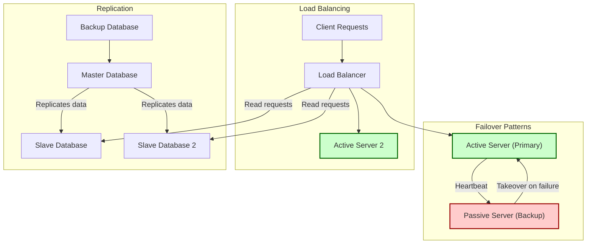

# Availability & Fault Tolerance

Ensuring your system remains operational and responsive despite failures is crucial for delivering a reliable user experience. This guide explores fundamental concepts and approaches to increase system availability and fault tolerance by leveraging redundancy, replication, failover mechanisms, and monitoring.

---

## Understanding Availability

**Availability** measures the proportion of time a system is accessible and functional for users. It is commonly expressed as a percentage of uptime over a defined period (e.g., 99.9%, 99.99%). High availability ensures that service interruptions are minimal and short-lived.

> **Example:** A service with 99.99% availability can be down for approximately 52 minutes annually, or 8.6 seconds daily.

### Quantifying Availability

Availability is often expressed in "number of 9's" (e.g., three 9's = 99.9%).

| Availability   | Downtime per Year  | Downtime per Month | Downtime per Week | Downtime per Day |
|----------------|--------------------|-------------------|------------------|-----------------|
| 99.9% (three 9s)  | 8h 45m 57s        | 43m 49.7s         | 10m 4.8s         | 1m 26.4s        |
| 99.99% (four 9s) | 52m 35.7s          | 4m 23s            | 1m 5s            | 8.6s            |

### Availability for Composed Systems

When a service is composed of multiple components, overall availability depends on how these components are arranged:

- **In Series (Sequential):** Total availability is the product of availabilities.

  ```
  Availability_Total = Availability_A * Availability_B
  ```

  Two components with 99.9% availability each yield an overall availability of 99.8%.

- **In Parallel:** Total availability increases; system is available if any component is available.

  ```
  Availability_Total = 1 - (1 - Availability_A) * (1 - Availability_B)
  ```

  Two components with 99.9% availability each result in 99.9999% overall.

---

## Fault Tolerance: Designing for Failure

**Fault tolerance** is the system's ability to continue operation when one or more components fail. It relies on: 

- Designing systems with redundancy
- Using replication to maintain copies
- Implementing failover mechanisms to switch quickly to backup systems
- Proactively monitoring to detect and react to issues

### Redundancy Techniques

Redundancy introduces extra hardware or software resources to provide backups, ensuring no single point of failure.

- **Active-Passive:** One active node handles the load; a passive node waits in standby.
- **Active-Active:** Multiple nodes serve clients simultaneously, distributing load and providing failover.

#### Active-Passive Failover

- Heartbeat signals are exchanged between active and passive servers.
- Passive takes over IP and service if active fails.
- Downtime depends on whether the passive node is in hot standby (already running) or cold standby (starting up).
- Also called master-slave failover.

#### Active-Active Failover

- Both servers actively manage traffic, balancing load.
- DNS or application logic must be aware of multiple active nodes.
- Also called master-master failover.

#### Trade-offs

- **Active-passive setups** can incur downtime during failover.
- **Active-active setups** provide higher availability but increase system complexity.

### Replication

Replication maintains multiple synchronized copies of data or services across nodes, boosting availability and fault tolerance.

Two common replication patterns:

- **Master-Slave (Master-Replica):** Master node handles writes; slaves handle reads and replicate writes asynchronously.
- **Master-Master:** Multiple masters both handle reads and writes and synchronize.

See the [Database replication](#database) and related sections for more details.

### Common Challenges With Replication & Failover

- Potential for data loss if active system fails before replication completes.
- Increased complexity in promoting replicas or synchronizing nodes.
- Lag in replica updates impacting read consistency.
- Extra hardware and operational overhead.

---

## Monitoring & Detecting Failures

Visibility into system health is essential to catch failures early and react promptly.

### Key Monitoring Practices

- **Heartbeat Checks:** Periodic health signals between redundant nodes.
- **Application-Level Health Checks:** Endpoints reporting application status.
- **Resource Metrics:** Monitor CPU, memory, disk I/O, network latency, request rate.
- **Alerting & Incident Management:** Use tools like PagerDuty, Sentry to notify teams.

### Practical Tips

- Implement automated failover triggers based on monitoring signals.
- Use multiple monitoring layers to avoid false positives.
- Test your failover and redundancy setups regularly.

---

## Best Practices for Achieving High Availability

- **Eliminate single points of failure:** Use load balancers, replicated databases, redundant hardware.
- **Design stateless services:** So instances can be added or replaced transparently.
- **Use distributed data:** Employ sharding and replication to handle growth and failures.
- **Plan for failover and disaster recovery:** Backup data and test recovery processes.
- **Automate monitoring and recovery:** Automate detection and reactions to reduce downtime.

---

## Summary

Designing for availability and fault tolerance means balancing complexity, cost, and business requirements. Through careful use of failover patterns, replication strategies, and robust monitoring, systems can minimize downtime and ensure resilience in production environments.

## References & Further Reading

For deeper exploration, see related topics in this documentation:

- [Availability patterns](https://github.com/donnemartin/system-design-primer#availability-patterns)
- [Replication](https://github.com/donnemartin/system-design-primer#replication)
- [Failover](https://github.com/donnemartin/system-design-primer#fail-over)
- [Database replication](https://github.com/donnemartin/system-design-primer#database)
- [Monitoring and alerting](https://github.com/donnemartin/system-design-primer#monitoring--metrics)

Official external resources:
- [CAP Theorem Revisited](http://robertgreiner.com/2014/08/cap-theorem-revisited/)
- [Scalability, availability, stability, patterns](http://www.slideshare.net/jboner/scalability-availability-stability-patterns/)

---

### Mermaid Diagram: Availability Patterns Flow


