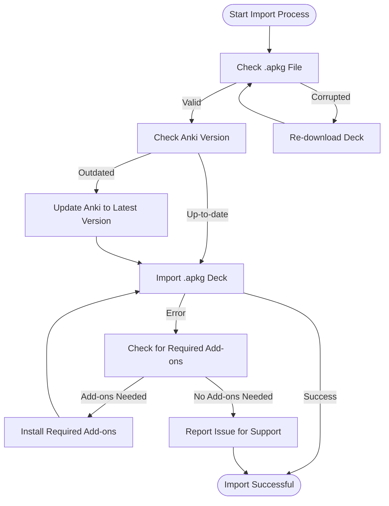

# FAQ: Anki Flashcard Deck Won't Import—What Should I Do?

This guide helps you resolve common problems when importing `.apkg` flashcard decks into Anki, such as corrupted files, version incompatibilities, and missing dependencies. It also provides practical steps to troubleshoot and links to official Anki resources.

---

## 1. Common Import Issues

### What causes an Anki flashcard deck `.apkg` file not to import?
- The file may be corrupted or incomplete due to an interrupted download or disk errors.
- The deck may have been created with a newer Anki version incompatible with your current app.
- Required add-ons or dependencies might be missing for decks that rely on extended features.
- File extension or naming problems causing Anki not to recognize the file.

<Tip>
Always download `.apkg` decks from trusted sources and verify file sizes to ensure completeness.
</Tip>

### How do I check if my `.apkg` file is corrupted?
- Try opening it with another computer or Anki install.
- Re-download the file if suspicious.
- Check for unusual file size (zero bytes or too small).

### Which Anki versions are supported for these decks?
- Use the latest stable version of Anki from [https://apps.ankiweb.net/](https://apps.ankiweb.net/).
- Some decks may require specific versions; check any README or accompanying notes.

<Note>
Running an outdated Anki version is the #1 cause of import failures with newer `.apkg` decks.
</Note>

---

## 2. Step-by-Step Import Troubleshooting

<Steps>
<Step title="Step 1: Update Anki">
Ensure you have the latest Anki version installed to avoid compatibility issues.
</Step>
<Step title="Step 2: Verify File Integrity">
Check the `.apkg` file size and re-download it if necessary.
</Step>
<Step title="Step 3: Import the Deck">
Use Anki's 'File' > 'Import' menu to import the `.apkg` file.
</Step>
<Step title="Step 4: Check for Add-on Requirements">
If the deck uses custom card types or scripts, install required add-ons before importing.
</Step>
<Step title="Step 5: Use Anki Troubleshooting Tools">
Refer to the official Anki Troubleshooting page for advanced diagnostics (<https://docs.ankiweb.net/troubleshooting.html>).
</Step>
</Steps>

<Tip>
If you suspect add-ons might cause conflicts, try disabling them temporarily and re-import.
</Tip>

---

## 3. Common Pitfalls

- **Partial or corrupted downloads:** Always verify the file checksum or size.
- **Using older Anki versions:** Upgrade to at least Anki 2.1+ to support most `.apkg` decks properly.
- **Filename issues:** Ensure the deck file has a `.apkg` extension and no special characters.
- **Add-on dependencies:** Some study decks come with supplementary scripts requiring add-ons; missing them causes import failures.

---

## 4. When Import Errors Occur

### What if I see error messages during import?
- Read the error carefully to identify if it’s about version mismatch, missing files, or corrupted data.
- Common error: 'file corrupted' or 'invalid file format'.
- Retry downloading and importing after updating Anki.

### How do I recover from an import failure due to corruption?
- Obtain a fresh copy of the deck.
- Use file repair tools or unzip `.apkg` archive manually to check contents.

---

## 5. Best Practices for Using Provided `.apkg` Decks

- Always keep Anki updated before importing new decks.
- Follow download instructions carefully—some decks include metadata or supplementary files.
- Use the official [System Design Primer Anki decks](resources/flash_cards/) for consistent quality.
- Check GitHub issues or FAQ if a particular deck fails to import.

---

## 6. Related Official Resources

- [Anki Manual — Importing and Exporting](https://docs.ankiweb.net/importing.html)
- [Anki Troubleshooting](https://docs.ankiweb.net/troubleshooting.html)
- [AnkiWeb deck download and FAQ](https://ankiweb.net/shared/info/)

---

## 7. Getting Further Help

- Use the community discussion forums such as [Anki Forums](https://forums.ankiweb.net) or GitHub issues in the System Design Primer repo.
- If the issue persists, contact Anki support with detailed logs and error messages.

<Check>
Before reporting an issue, verify your Anki version, deck file integrity, and provide exact error messages for faster support.
</Check>

---

## 8. Summary Diagram: Import Troubleshooting Flow

---

## 9. Example: Importing System Design Primer OO Design Deck

Here is a quick example for the `OO Design.apkg` deck used within the System Design Primer materials:

1. Download the `OO Design.apkg` file from [resources/flash_cards/](resources/flash_cards/OO%20Design.apkg).
2. Open Anki and navigate to `File > Import`.
3. Select the `.apkg` file and confirm import.
4. If import fails, confirm you are running Anki 2.1 or later.
5. If the deck requires add-ons (rare for these decks), install them before importing.

This deck has been tested on recent Anki versions and should import smoothly if these steps are followed.

---

For more in-depth details on deck structure and usage, see the [Using Anki Flashcards Effectively](guides/core-study-workflows/using-anki-flashcards-effectively) page.

---

# Additional Tips

- When sharing decks, include version info and dependencies clearly.
- Backup your existing Anki collection before importing large decks.
- If you face any unexplained errors, try importing a small vanilla deck to isolate the issue.

---

For further questions, check these related FAQ entries:

- [How do I use the Anki flashcard decks effectively?](faq/general-usage-faq/how-to-use-flashcards)
- [Troubleshooting Common Issues](getting-started/validation-support/troubleshooting-common-issues)

---

This page is part of the Troubleshooting & Optimization FAQ group helping you make the most of your study workflow with Anki flashcards.

---