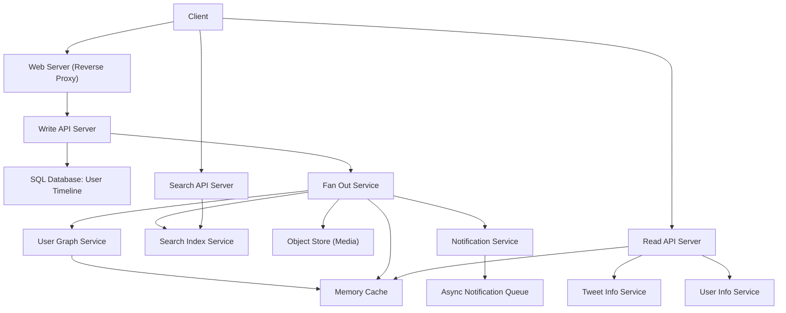

# Sample System Design Walkthroughs

Welcome to a curated collection of detailed, step-by-step system design walkthroughs. Each example simulates an end-to-end solutioning process, precisely demonstrating how to approach real-world architecture challenges, analyze trade-offs, anticipate scalability needs, and utilize annotated diagrams effectively.

---

## How to Use This Guide

These walkthroughs are designed to support your learning and interview preparation by guiding you through representative systems such as social networks, data stores, web crawlers, and financial management platforms.

**Approach each walkthrough progressively:**

- Start by understanding the key use cases and system constraints.
- Examine the high-level design, focusing on components and interactions.
- Dive into core feature designs through real example code and API usage.
- Explore scalability considerations and bottleneck resolution strategies.
- Review the annotated diagrams for visual comprehension.

<Info>
Refer to the [System Design Interview Questions with Solutions](#system-design-interview-questions-with-solutions) section in the Primer for full context.
</Info>

---

## Walkthrough Examples Included

### 1. Designing the Twitter Timeline and Search

- **Problem Scope**: Handle posting tweets, viewing user and home timelines, and searching keywords with high availability.
- **Use Cases**: Posting a tweet, viewing timelines, searching tweets.
- **Core Components**: Web Server, Write API, Read API, Fan Out Service, User Graph Service, Memory Cache, Search Service, Object Store, Notification Service.
- **Technical Strategies**:
  - Store tweets in SQL for user timeline, NoSQL or in-memory for home timeline fan-out.
  - Use cache for fast read-heavy optimizations.
  - Incorporate asynchronous notifications.
  - Apply fanout optimizations for high-follower users.
  - REST API examples provided.

### 2. Designing a System That Scales to Millions of Users on AWS

- **Goal**: Architect an evolving system from a minimal deployment for 1-2 users to advanced scaling for millions.
- **Progressive Scaling Steps**:
  - Single box with web server and MySQL.
  - Decouple static content with Object Store.
  - Separate DB and web server to support independent scaling.
  - Add load balancers, multiple app and web servers with failover.
  - Introduce caching layers (ElastiCache) and read replicas.
  - Use autoscaling based on load metrics.
  - Employ SQL tuning, federation, sharding, denormalization for DB scaling.
- **Security**: Virtual Private Cloud, encryption, firewall rules are essential.

### 3. Designing Mint.com

- **Use Cases**: Users connect financial accounts; system extracts and categorizes transactions; recommend budgets; notify users.
- **Architecture Highlights**:
  - Web Server, Accounts API, Transaction Extraction Service, Category Service, Budget Service, Notification Service.
  - Asynchronous processing with queues for transaction extraction.
  - Use SQL databases with appropriate indexing for accounts, transactions, and spending aggregates.
- **Data Processing**:
  - Categorization of transactions using seller-category mappings.
  - Batch or MapReduce job to aggregate monthly spending.
- **Scaling**:
  - Use memory cache (Redis) for sessions and recent transactions.
  - Employ analytics databases or data warehouse for long-term storage.
  - Adopt NoSQL where appropriate.

### 4. Designing the Data Structures for a Social Network

- **Primary Feature**: Allow users to search for another person and see the shortest path (degrees of separation).
- **Challenges**: High volume of users and friend relationships make single-machine in-memory graph infeasible.
- **Architecture Elements**:
  - Person Servers sharded by user IDs.
  - Lookup Service to find Person Servers.
  - User Graph Service performing BFS searches over sharded data, coordinating through RPC.
  - Use of in-memory caching (Redis) to speed up frequent lookups and batch friend retrievals.

### 5. Designing a Key-Value Cache for Search Engine Queries

- **Requirement**: Cache results of recent search queries and serve with low latency.
- **Cache Design**:
  - Memory Cache with LRU eviction, implemented with hash map + doubly-linked list.
  - Query API server parses and normalizes queries.
  - Cache misses query Reverse Index Service and Document Service, then cache updates.
- **Scaling**:
  - Horizontally shard cache cluster with consistent hashing.
  - Discuss trade-offs of replication vs unique caches per node.
  - Cache expiration strategies with TTL.

### 6. Designing Amazon's Sales Rank by Category Feature

- **Use Case**: Compute and serve weekly popular products per category.
- **Data Source**: Sales API server logs stored on object store (like S3).
- **Batch Processing**:
  - Use MapReduce to compute total units sold per product per category during past week.
  - Sort results via distributed sorting.
- **Storage**:
  - Store computed sales ranks in SQL database with indices.
- **Serving**:
  - Expose REST API to fetch popular products by category.
- **Scaling Considerations**:
  - Use caching layers for hot content.
  - Employ SQL scaling patterns and data warehouse solutions for analytics.

### 7. Designing a Web Crawler

- **Features**: Crawl URLs, generate reverse index, produce static titles and snippets.
- **Constraints**: Avoid infinite loops, support periodic refresh, handle large-scale data.
- **Architecture**:
  - NoSQL store for links to crawl and crawled signatures.
  - Crawler Service manages URL queues, avoids crawling duplicates with signatures.
  - Queues for Reverse Index and Document Service for downstream processing.
- **Duplicate Handling**:
  - Use MapReduce for large-scale duplicate URL detection.
  - Content similarity computation strategies.
- **Serving Search Queries**:
  - Query API server uses reverse index and Document Service.
  - Cache popular queries.

---

## Representational Sample REST API Calls

Most walkthroughs provide practical REST API usage examples, such as:

```bash
curl -X POST --data '{ "user_id": "123", "status": "hello world!" }' https://twitter.com/api/v1/tweet
```

or

```bash
curl https://amazon.com/api/v1/popular?category_id=1234
```

These assist in understanding expected inputs and outputs.

---

## Additional Resources

- [System Design Topics Index](https://github.com/donnemartin/system-design-primer#index-of-system-design-topics)
- [Scalability and Performance Models](https://github.com/donnemartin/system-design-primer#scalability-and-performance)
- [Caching Patterns](https://github.com/donnemartin/system-design-primer#caching-strategies)
- [Communication Patterns](https://github.com/donnemartin/system-design-primer#remote-procedure-call-rpc)
- [Security Considerations](https://github.com/donnemartin/system-design-primer#security)

<Callout>
Continue practicing by exploring these comprehensive, worked examples. They bridge theory and practical application with robust code, diagrams, and reasoning.
</Callout>

---

## Diagrammatic Overview (Example: Twitter Timeline & Search)


```

---

## Troubleshooting & Tips

- Always clarify system constraints and usage assumptions upfront.
- Benchmark and profile your design iteratively to identify bottlenecks.
- Use caches wisely considering data freshness and invalidation strategies.
- Consider trade-offs between SQL and NoSQL based on access patterns and relational needs.
- Asynchronous processing enhances scalability but adds complexity.
- Apply horizontal scaling for handling high load and availability.
- Secure components at network and data layers including encryption and access control.

---

## Next Steps

- Explore linked System Design topics for detailed principles.
- Practice with additional design interview questions and coding exercises.
- Leverage Anki flashcards for key concept retention.
- Review real-world architectures and engineering blog posts for applied insights.

---