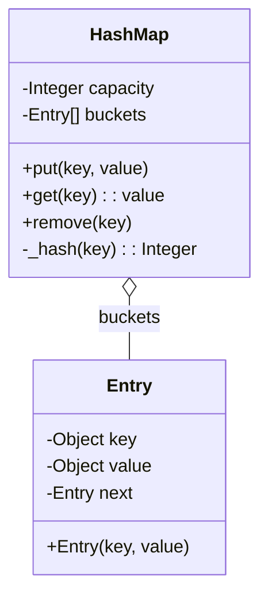

# Solving Object-Oriented Design Questions

A practical guide for object-oriented design interviews, focusing on real-world problems through typical question types and sample answers. This guide helps you model systems with objects, communicate your design choices clearly, and prepare effectively for interviews using discussion, diagrams, and Python code examples.

---

## 1. Introduction

Object-oriented design (OOD) questions evaluate your ability to break down a problem into interacting components (objects), define their responsibilities, and produce clean, maintainable solutions. These questions often appear in technical interviews and require clear communication of your thought process.

This guide will help you:

- Understand the intent and purpose of OOD interview questions
- Follow a step-by-step process to analyze and solve these problems
- Leverage concrete examples, code, and diagrams for clear explanations
- Avoid common pitfalls by applying best practices

---

## 2. Workflow Overview

### Task Description
This guide helps you solve typical object-oriented design interview questions by modeling real-world problems with objects and composing solutions that can be clearly communicated.

### Prerequisites
- Basic knowledge of object-oriented programming concepts such as classes, inheritance, encapsulation, and polymorphism
- Familiarity with Python syntax (examples are in Python but concepts are general)
- Understanding of design principles like SOLID (recommended for deeper mastery)

### Expected Outcome
By following this guide, you will be able to:
- Approach OOD problems confidently
- Create object models that align with the problem domain
- Express your design decisions clearly with diagrams and code
- Recognize trade-offs, alternatives, and scalability

### Time Estimate
20-45 minutes per problem for initial practice; interview questions are typically solved in 45-60 minutes including discussion.

### Difficulty Level
Intermediate — suitable for software engineers preparing for technical interviews.

---

## 3. Step-by-Step Approach to Solve OOD Questions

Follow these steps sequentially; each builds on the previous to develop a comprehensive design.

<Steps>

<Step title="Step 1: Understand the Problem Requirements">
Gather detailed requirements and constraints. Ask clarifying questions when possible.

- Who are the users or entities involved?
- What operations must the system support?
- What are the inputs and outputs?
- What are the scale and performance constraints?

Understanding the scope helps avoid over-engineering and focuses your design.
</Step>

<Step title="Step 2: Identify Key Objects and Responsibilities">
Translate requirements into objects.

- Identify the nouns in the problem description as candidate objects
- Define each object's responsibilities clearly
- Consider data and behavior for each object
- Use techniques like CRC cards (Class-Responsibility-Collaborator) to organize thoughts

Naming objects in domain terms increases clarity and alignment.
</Step>

<Step title="Step 3: Define Class Relationships and Interactions">
Determine how objects relate:

- Is there inheritance? (is-a relationship)
- Are there associations, compositions, or aggregations?
- Describe interactions (method calls, event flows)
- Aim for loose coupling and high cohesion

Sketch UML class diagrams to visualize.
</Step>

<Step title="Step 4: Design Methods and Interfaces">
Define what operations classes provide and expect:

- Public methods that represent meaningful actions
- Constructor and initialization logic
- Consider access modifiers and encapsulation

Keep interfaces minimal yet expressive.
</Step>

<Step title="Step 5: Consider Edge Cases, Scalability, and Extensibility">
Reflect on:

- Handling invalid inputs and error conditions
- Ways to extend without modifying existing code (Open/Closed Principle)
- Potential performance bottlenecks

Be prepared to discuss trade-offs.
</Step>

<Step title="Step 6: Validate the Design and Iterate">
Review your design:

- Apply design principles (SOLID, DRY)
- Simplify when possible
- Explain design decisions clearly
- Adjust based on feedback or new insights
</Step>

</Steps>

---

## 4. Real-World Examples & Code Samples

### Example: Design a Hash Map

**Problem Statement:** Design a hash map that supports put, get, and remove operations.

### Key Classes/Objects
- HashMap
- Entry (key-value pair)

### Python Code Example
```python
class Entry:
    def __init__(self, key, value):
        self.key = key
        self.value = value
        self.next = None  # For handling collisions using chaining

class HashMap:
    def __init__(self, capacity=1000):
        self.capacity = capacity
        self.buckets = [None] * self.capacity

    def _hash(self, key):
        return hash(key) % self.capacity

    def put(self, key, value):
        index = self._hash(key)
        if not self.buckets[index]:
            self.buckets[index] = Entry(key, value)
            return
        current = self.buckets[index]
        while True:
            if current.key == key:
                current.value = value
                return
            if not current.next:
                break
            current = current.next
        current.next = Entry(key, value)

    def get(self, key):
        index = self._hash(key)
        current = self.buckets[index]
        while current:
            if current.key == key:
                return current.value
            current = current.next
        return None

    def remove(self, key):
        index = self._hash(key)
        current = self.buckets[index]
        prev = None
        while current:
            if current.key == key:
                if prev:
                    prev.next = current.next
                else:
                    self.buckets[index] = current.next
                return
            prev = current
            current = current.next
```

### UML Class Diagram


---

### Example: Design a Call Center

**Problem:** Design an object-oriented model for a call center where calls are routed to available employees according to their rank.

### Objects & Relationships
- CallCenter
- Employee (with subclasses: Respondent, Manager, Director)
- Call

### Design Considerations
- Calls are assigned to the lowest ranked available employee
- Calls can be escalated to higher ranks if not answered

### Simplified Pseudocode for Routing
```python
class Call:
    def __init__(self, caller_id):
        self.caller_id = caller_id
        self.handler = None

class Employee:
    def __init__(self, rank):
        self.rank = rank
        self.current_call = None

    def is_free(self):
        return self.current_call is None

    def receive_call(self, call):
        self.current_call = call
        call.handler = self

class CallCenter:
    def __init__(self):
        self.employees = {
            'respondent': [],
            'manager': [],
            'director': []
        }

    def dispatch_call(self, call):
        for rank in ['respondent', 'manager', 'director']:
            for employee in self.employees[rank]:
                if employee.is_free():
                    employee.receive_call(call)
                    return True
        return False  # no one free
```

---

## 5. Troubleshooting, Tips & Best Practices

### Common Issues
- Overcomplicating your design: start simple, extend as needed
- Mixing responsibilities in one class: adhere to single responsibility
- Not handling edge cases like invalid inputs or empty states
- Forgetting to consider performance or scale implications

### Best Practices
- Use clear, domain-driven naming
- Draw diagrams to communicate your ideas effectively
- Talk through your reasoning and trade-offs
- Write code snippets that are clean and demonstrate key aspects
- Consider extensibility and maintainability
- Validate assumptions with your interviewer early

### Performance Considerations
- Anticipate hotspots and caching opportunities
- Avoid unnecessary inheritance; prefer composition where it fits
- Use interfaces/abstract classes to increase flexibility

### Alternative Approaches
- Vary designs based on use cases (e.g., synchronous vs asynchronous handling)
- Use design patterns (Singleton, Factory, Observer, etc.) where appropriate

---

## 6. Next Steps & Related Content

- Practice solving real OOD interview questions with code and diagrams.
- Review [Object-oriented design interview questions with solutions](https://github.com/donnemartin/system-design-primer#object-oriented-design-interview-questions-with-solutions) in the Primer repository.
- Study SOLID principles, design patterns, and system architecture basics to deepen your knowledge.
- Explore system design topics in the Primer to complement your OOD skills.

---

## 7. Summary

Object-oriented design interviews demand clarity, focus on user goals, and a manageable approach to problem-solving. This guide walks you step-by-step, using concrete examples, diagrams, and Python code to model common problems like hash maps and call centers. Studying this material prepares you to communicate your design rationale and demonstrate coding proficiency in interviews.

---

## References
- [System Design Primer GitHub Repository](https://github.com/donnemartin/system-design-primer)
- [Object-oriented design interview questions & solutions](https://github.com/donnemartin/system-design-primer#object-oriented-design-interview-questions-with-solutions)
- [Design principles: SOLID](https://en.wikipedia.org/wiki/SOLID)
- [UML Class Diagrams](https://ru.wikipedia.org/wiki/%D0%9A%D0%BB%D0%B0%D1%81%D1%81%D0%BE%D0%B2%D0%B0%D1%8F_%D0%B4%D0%B8%D0%B0%D0%B3%D1%80%D0%B0%D0%BC%D0%BC%D0%B0)

---

For further practice, explore hands-on problems and flashcards in the Primer's interactive learning resources.