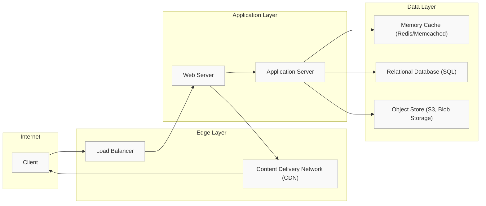

# System Design at a Glance

Get a comprehensive big-picture overview of critical system design challenges and foundational concepts—like scalability, reliability, trade-offs, and bottlenecks—brought to life through clear, approachable mermaid diagrams mapping high-level architectures.

---

## Why This Overview Matters

Designing scalable, reliable systems is complex. At its core lie recurring patterns and trade-offs that every engineer must grasp to build impactful software. This page distills those essentials, helping you quickly grasp the landscape before diving into specific solutions or interview questions.

By translating intricate architecture concepts into intuitive diagrams and user-focused narratives, you’ll be equipped to:

- Understand how systems evolve and scale
- Recognize typical bottlenecks and mitigation strategies
- Balance performance versus availability
- Navigate fundamental trade-offs like consistency vs availability

This high-level understanding is your launching pad for confident system design thinking.

---

## What You Will Find Here

### Key Design Challenges Explored

- **Scalability:** How systems handle increasing users and data gracefully.
- **Reliability & Availability:** Ensuring uptime amidst failures.
- **Trade-offs:** Weighing options like latency vs throughput, consistency vs availability.
- **Bottlenecks:** Identifying and addressing performance limitations.

### Illustrated Concepts

Each concept is illustrated with accessible mermaid diagrams focused on core components and their interactions, avoiding internal complexity or low-level implementation details.

- Diagrams outline components such as Load Balancers, Web & Application Servers, Databases, Caches, and CDNs.
- User flows depict common request paths and highlight potential scalability or availability trade-offs.

### User-Centric Approach

All content focuses on what users want to achieve—fast, reliable access to data and features—rather than on internal implementation, making it relevant for engineers preparing for system design interviews or those refining their architectural intuition.

---

## Key Concepts Explained

### 1. Scalability

Scaling a system means it continues to perform efficiently as demand grows. This involves:

- **Vertical Scaling:** Bigger machines with more resources
- **Horizontal Scaling:** Adding more machines in parallel
- Strategic use of caching and data partitioning

### 2. Availability and Reliability

Systems must survive failures and stay operational.

- **Failover Patterns:** Active-passive (master-slave) and active-active (master-master) setups
- **Replication:** Data copies across machines to guard against loss
- **Handling Single Points of Failure:** Load balancers, redundant servers

### 3. Trade-offs

Designing distributed systems inherently requires trade-offs.

- **Performance vs Scalability:** Single-user latency vs system-wide throughput
- **Latency vs Throughput:** Response time vs requests per second
- **Consistency vs Availability:** CAP theorem insights

### 4. Bottlenecks

Identifying slow or overloaded components helps in scaling strategies.

- Database write limitations
- Cache size constraints
- High-latency network links

---

## Sample High-Level Architecture Diagram

This diagram captures the typical layered approach:

- **Clients** communicate via a **Load Balancer**
- Cached static content served by a **CDN** for minimal latency
- Web and application servers handle business logic and API processing
- Fast access to frequently read data through an in-memory **Cache**
- Durable storage via a **Relational Database** and scalable **Object Store** for media/data blobs

---

## Practical Tips and Common Pitfalls

- **Benchmark & Profile Early:** Don't jump to final designs prematurely. Measure realistic usage.
- **Separate Concerns:** Isolate static content, dynamic APIs, and databases for independent scaling.
- **Cache Wisely:** Cache hot data close to where it's consumed; evict stale data promptly.
- **Design for Failures:** Assume components will fail and build redundancy.
- **Understand Trade-Offs:** Always clarify your business priorities to balance consistency, availability, and performance.

---

## How to Apply This Overview

Leverage this big-picture view as a foundation for deeper dives into specific systems or interview questions.

1. Review system concepts with focus on scalability and reliability
2. Use diagrams to visualize request flow and bottlenecks
3. Explore linked documentation for detailed patterns and real-world examples
4. Practice designing or analyzing systems using these core themes

---

## Related Resources

- [System Design Topics Index](https://github.com/donnemartin/system-design-primer#index-of-system-design-topics) for detailed breakdowns
- [Design the Twitter timeline and search](https://github.com/donnemartin/system-design-primer/blob/main/solutions/system_design/twitter/README.md) — example use-case with architecture and trade-offs
- [Design a system that scales to millions of users on AWS](https://github.com/donnemartin/system-design-primer/blob/main/solutions/system_design/scaling_aws/README.md) — practical scaling patterns
- [Core System Design Concepts](https://github.com/donnemartin/system-design-primer/blob/main/concepts/architecture-foundations/core-system-concepts.md)

By mastering this overview, you gain the framework needed to approach complex system design challenges methodically and confidently.