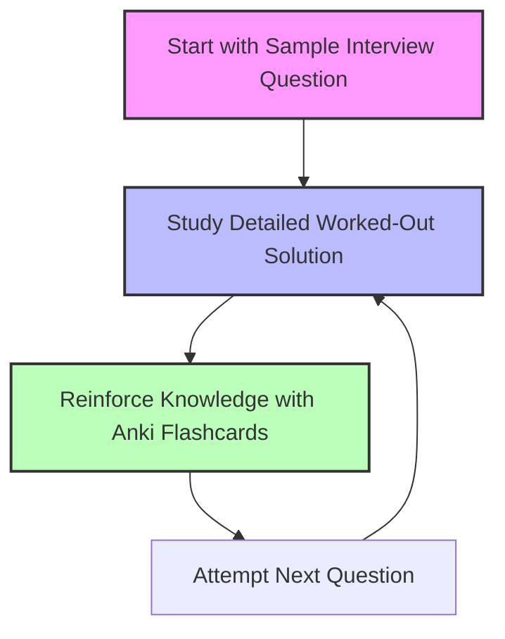

# Interview Practice: Questions, Solutions, and Flashcards

## Accelerate Your System Design Interview Preparation

Facing a system design interview can be daunting, but mastering it is vital for many technical roles. This part of the primer gives you hands-on interactive features—complete with sample interview questions, detailed worked solutions, and integrated Anki flashcards—to help you build confidence and reinforce your knowledge effectively.

### Why Focus Here?

This page is designed to be your active study partner, going beyond passive reading. It supports deliberate practice with real questions and tailored solutions, reinforcing what you’ve learned in theory and helping you apply concepts to solve real-world problems.

---

## What To Expect

### 1. Sample Interview Questions

- Carefully designed questions represent common and challenging system design interview topics.
- Each question includes clear requirements, constraints, and goals resembling real interview situations.
- Questions give you a practical framework to hone your problem scoping, assumption making, and solution planning skills.

### 2. Worked-Out Solutions

- Detailed solution walkthroughs guide you step-by-step through designing scalable systems.
- Includes discussions of use cases, high-level architecture, core component designs, and scalability plans.
- Provides concrete examples and code snippets you can relate to and learn from.

### 3. Anki Flashcard Integration

- Flashcards reinforce key concepts and terminologies using spaced repetition.
- Server-side integration enables seamless downloading and using of official Anki decks.
- Structured decks include system design principles, solution steps, and common interview pitfalls.

---

## How the Features Build Your Confidence

**Visualize the journey of an interview preparation:**

1. **You start with a question:** Frame the problem, clarify scope, and engage your critical thinking.

2. **You explore the solution:** Understand each component’s role, core considerations, and trade-offs.

3. **You reinforce learning with flashcards:** Key topics stay fresh through repetition and active recall.

This iterative flow enhances mastery and reduces the stress of jumping into interviews unprepared.

---

## Practical Tips for Using This Page

- **Start Small:** Pick a couple of interview questions to work through, especially those aligning with your target roles.
- **Simulate Real Interviews:** Time yourself, draft answers aloud, and compare with the solutions.
- **Use Flashcards Consistently:** Integrate Anki into your daily routine for long-term retention.
- **Review Common Pitfalls:** Understand tradeoffs and alternatives, not just the "correct" answers.

---

## Sample Workflow

### Step 1: Pick a Question

For example, you might start with "Design the Twitter timeline and search".

### Step 2: Understand the Problem

Outline use cases and constraints. Frame assumptions.

### Step 3: Review the High-Level Design

Study architecture diagrams and component interactions.

### Step 4: Dive into Core Components

See how each part works: write API, fan-out service, memory cache, etc.

### Step 5: Practice Scalability

Explore bottlenecks and scaling patterns, including caching and sharding.

### Step 6: Test Yourself with Flashcards

Quiz yourself on key concepts and design patterns found in the solution.

---

## Example Hands-On Question: Designing the Twitter Timeline and Search

> Use the full solution for Twitter timeline and search available here:
> [Design the Twitter timeline and search](https://github.com/donnemartin/system-design-primer/blob/main/solutions/system_design/twitter/README.md)

- Walk through use cases like posting a tweet, viewing timelines, searching.
- Learn how services interact: Write API, Fan Out Service, Search Cluster, User Graph Service.
- Explore caching strategies to enable fast reads and the reasoning behind component choices.

This concrete example illustrates how sample questions translate theory into practice.

---

## Troubleshooting Common Challenges

<AccordionGroup title="Common Interview Prep Challenges">
<Accordion title="Feeling Overwhelmed by the Breadth of Topics">
Take advantage of the flashcards to focus on high-impact concepts, and work through questions gradually. Set realistic goals and revisit material frequently.
</Accordion>
<Accordion title="Difficulty Understanding Solution Trade-Offs">
Focus on the discussion sections in worked solutions, which explain pros and cons of design decisions and scaling choices. Evaluate trade-offs based on the scenario rather than trying to memorize perfect solutions.
</Accordion>
<Accordion title="Retention Issues with Key Concepts">
Use the Anki flashcard decks consistently. Spaced repetition ensures long-term retention of critical knowledge.
</Accordion>
</AccordionGroup>

---

## Getting Started

### Prerequisites

- Basic familiarity with core system design concepts.
- Understanding how high-level architectures are represented.

### Quick Start

- Browse through a sample system design question on this page.
- Open the linked solution documents for detailed guidance.
- Download and begin reviewing associated Anki flashcard decks.

### Next Steps

- Proceed to [Get Started: How to Use the Primer](/overview/feature_workflows/quickstart_workflow) for tips on effective study workflows.
- Explore other feature pages: [Integrations & External Learning Resources](/overview/feature_workflows/integration_and_external_resources) for added materials.

---

## Related Resources

- [System design interview questions with solutions](/guides/interview-question-patterns/approaching-system-design-questions)
- [Using Anki Flashcards Effectively](/guides/core-study-workflows/using-anki-flashcards-effectively)
- [Get Started: How to Use the Primer](/overview/feature_workflows/quickstart_workflow)

---

## Summary

The Interactive Interview Practice features provide a structured environment to apply, practice, and retain system design knowledge through questions, solutions, and flashcards. By engaging with real-world interview problems and reinforcing concepts via spaced repetition, you dramatically improve your preparedness and confidence for technical interviews.

---

## Visual Summary Diagram

---

## Final Notes

This page is your gateway to practical system design interview preparation. Leverage it consistently to turn knowledge into practice-ready skill.

---

*For detailed coding examples and full solutions per question, always refer to the linked solution documents in the [solutions](https://github.com/donnemartin/system-design-primer/tree/main/solutions) folder of the repository.*