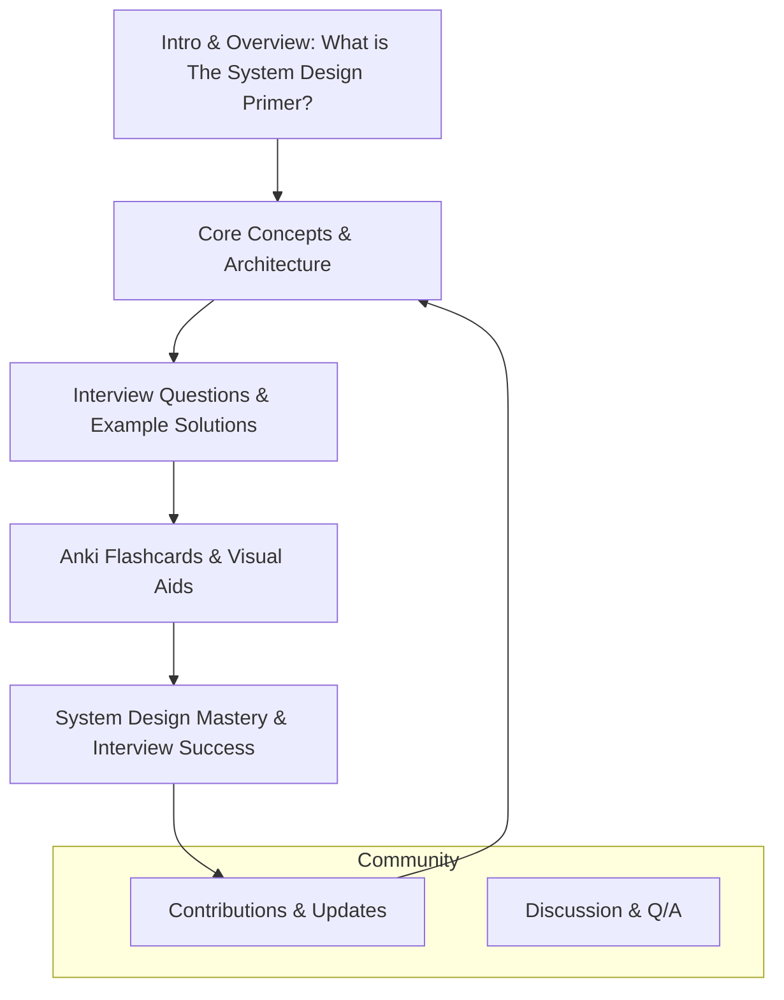

# What is The System Design Primer?

## Unlocking Scalable System Design Mastery

The System Design Primer is an organized, open-source collection of system design resources crafted specifically for engineers who want to master scalable architectures and excel in system design interviews. It serves as a comprehensive, structured guide through the complex landscape of system design, bringing together materials that demystify large-scale architecture concepts and interview challenges.

### Why This Matters to You

Whether you are preparing for technical interviews at prominent tech companies or seeking to deepen your understanding of building robust, scalable systems, this Primer offers a clear path to both learning and application. It helps transform scattered knowledge into a cohesive learning experience, empowering you to confidently design systems that perform well at scale.

### Core Mission and Vision

- **Mission:** To provide an accessible, well-organized resource hub for engineers aiming to grasp the principles and practicalities of system design.
- **Vision:** To become the definitive open-source destination for systematic, effective study and mastery of system design fundamentals.

## What is The System Design Primer?

The Primer is a curated project compiling tutorials, explanations, example problems, solutions, diagrams, and code examples centered around system design. It focuses on engineering scalable and reliable systems, taking you step-by-step from foundational concepts to complex, real-world scenarios.

Its content is tailored for engineers preparing for system design interviews and those wishing to build large-scale, high-performing systems in their professional work.

## Key Benefits

- **Structured Learning Experience:** Materials are organized progressively to facilitate understanding from novice levels to deep expertise.
- **Interview Preparation:** Practice popular system design interview questions with detailed solutions, including code and diagrams.
- **Open Source, Community-Driven:** Regularly updated with contributions from worldwide engineers, ensuring freshness and relevance.
- **Practical Focus:** Emphasizes user intent and system outcomes rather than just technical minutiae, making learning applicable.

## How It Fits Into Your Learning Journey

The System Design Primer plays a pivotal role in your study progression:

- **Start Here for Fundamentals:** Introduces core concepts, terminology, and architectural patterns essential for scalable design.
- **Application through Practice:** Hands-on coding exercises and notebook solutions deepen your comprehension.
- **Interview Readiness:** Simulated interview questions with thoughtful walkthroughs boost your confidence and performance.

By integrating this Primer into your workflow, you gain not only knowledge but the ability to apply it effectively under interview pressure or practical engineering challenges.

## What’s Inside? Core Sections

- **Concepts and Fundamentals:** Basic principles of system design, including scalability, availability, and consistency trade-offs.
- **Design Patterns and Architectures:** Explanations of common system design architectures with real-world examples.
- **Practice Problems:** Object-oriented design and system design interview questions with detailed solutions.
- **Ancillary Materials:** Diagrams, flashcards, and curated reading lists for sustained mastery.

## How to Use This Resource

- Begin with the foundational modules that explain system design concepts and architecture basics.
- Progress to the section featuring interview question walkthroughs, actively practicing the solution approaches.
- Leverage flashcards and visual guides for ongoing reinforcement.
- Contribute or explore community contributions to stay engaged and updated.

<Tip>
This Primer fills the critical gap between theory and practical application, equipping you to design systems that stand up to real challenges and rigorous interviews.
</Tip>

## Practical Scenario

Imagine preparing for a system design interview with a top tech company. Instead of source-scanning disparate blogs or forums, you have a single, well-organized repository that not only teaches theory but walks you through the actual interview questions engineers face.

With The System Design Primer, you follow a clear path: learn the concepts, explore example systems, solve problems with provided solutions, and check your understanding with flashcards. This structured approach transforms overwhelming preparation into a manageable, confidence-building journey.

## Getting Started

If you’re new to The System Design Primer, start with the [Overview and Introduction](https://github.com/donnemartin/system-design-primer#readme) sections. For hands-on exposure, explore the [Object-Oriented Design Exercises](solutions/object_oriented_design/call_center/call_center.ipynb) or [System Design Interview Questions](solutions/system_design/social_graph/README.md).

Ensure you meet any prerequisites outlined and familiarize yourself with the [Navigation Map](https://github.com/donnemartin/system-design-primer#readme) to optimize your study flow.

Let this Primer be your gateway to mastering scalable system design and elevating your engineering career.

---

### References

- GitHub Repository: [System Design Primer](https://github.com/donnemartin/system-design-primer)
- Object-Oriented Design Exercises: [Call Center Design](solutions/object_oriented_design/call_center/call_center.ipynb)
- System Design Interview Questions with Solutions: [Social Graph](solutions/system_design/social_graph/README.md)
- Study Guides and Best Practices: Sections within the Primer
- Community Contributions and Updates: [Contributing Guidelines](CONTRIBUTING.md)

---

### Diagram: Position in Learning Workflow

